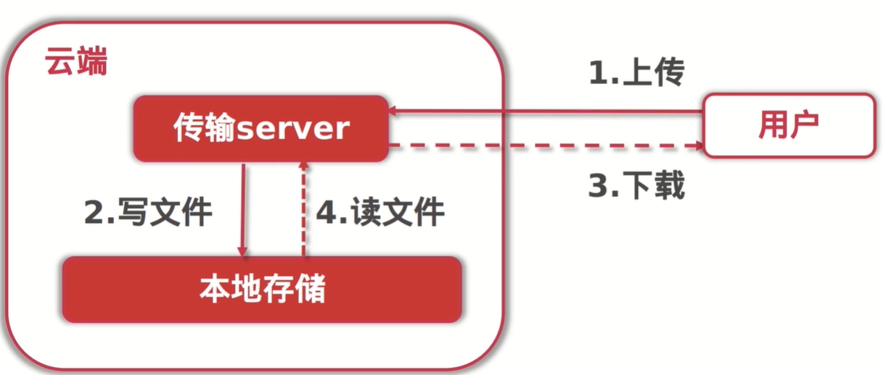

# 1. 导学

## 1.1 导学

### 课程目的
- Golang
- 云存储系统
- 微服务架构
- 云程序员

### 基础架构
1. 简单上传接口
2. 账号系统
3. 秒传
4. 分块上传 + 断点续传
5. Ceph + OSS
6. 微服务部署

## 1.2 课程介绍

### 要做什么？
- 基于Golang实现分布式文件上传服务
- 重点结合开源存储（Ceph）及共有云（阿里OSS）支持断点续传及秒传功能
- 微服务化及容器化部署

# 2. “云存储”系统原型【实现一个超精简版云盘】

- http header

## 2.1 “云存储”系统原型之简单文件上传服务架构说明
- 架构说明

- 接口列表

|接口描述|URL|
|-|-|
|文件上传|POST /file/upload|
|文件查询|GET /file/query|
|文件下载接口|GET /file/download|
|文件删除接口|POST /file/delete|
|文件修改（重命名）接口|POST /file/update|

## 2.2 实现上传接口

## 2.3 保存文件元信息
- 文件元信息
```go
type FileMeta struct {
    FileSha1 string
    FileName string
    FileSize int64
    Location string
    UploadAt string
}
```

## 2.4 实现单个文件查询信息接口

# 3. “云存储”系统之基于MySQL实现的文件数据库【持久化文件信息】
- docker 双mysql 配置主从
- RowsAffected检查
## 3.1 MySQL基础知识
## 3.2 MuSQL主从数据同步演示
## 3.3 文件表的设计及创建
## 3.4 编码实战：从文件表中获取元数据

# 4. "云存储"系统之基于用户系统实现的资源隔离及鉴权【账号和应用收入息息相关】
## 4.1 账号系统介绍与用户表设计
- 支持用户注册/登录
- 支持用户session鉴权
- 用户数据资源隔离
## 4.2 编码实战：实现用户注册接口
## 4.3 编码实战：实现用户登录接口
## 4.4 编码实战：实现用户信息查询接口
## 4.5 接口梳理小结
## 4.6 编码实战：快速实现访问鉴权接口+小结
